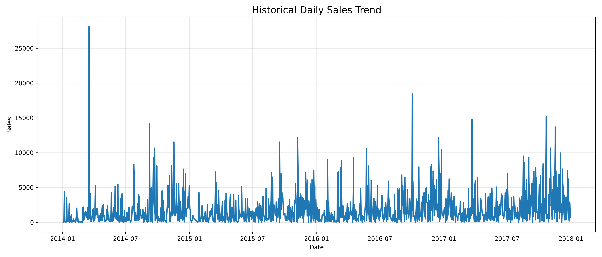
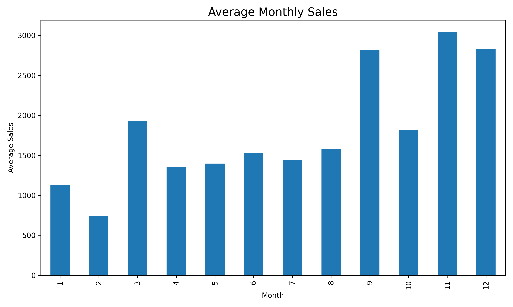
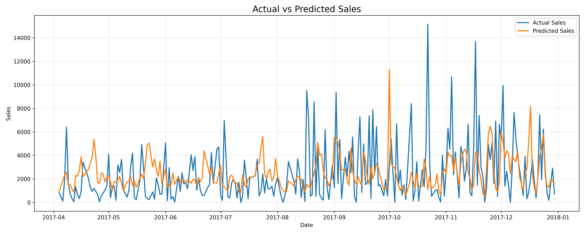
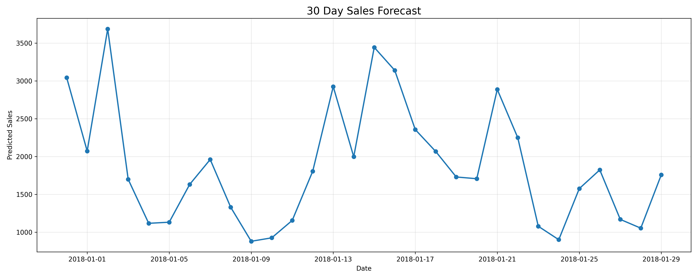

# Sales Demand Forecasting Using Machine Learning

## Project Overview

This project focuses on predicting future sales using historical business data from the Superstore dataset. Sales forecasting is one of the most important applications of Machine Learning in business because it helps organizations estimate future demand, optimize inventory, plan staffing requirements, and improve financial decision-making.

The objective of this project is to build a forecasting model that analyzes historical sales trends and predicts future sales while providing clear visualizations and business insights that can be understood by both technical and non-technical stakeholders.

---

## Problem Statement

Businesses need accurate sales forecasts to make informed decisions regarding:

* Inventory management
* Demand planning
* Budget allocation
* Workforce scheduling
* Revenue forecasting

Without forecasting, companies may experience stock shortages, excess inventory, increased operational costs, and poor resource allocation.

The goal of this project is to use Machine Learning to predict future sales based on historical sales patterns.

---

## Dataset

### Dataset Used

Superstore Sales Dataset

### Dataset Information

The dataset contains retail sales transactions and includes information such as:

* Order Date
* Sales
* Profit
* Category
* Sub-Category
* Region
* Customer Information
* Product Information

### Dataset Size

* Total Records: 9,994
* Total Columns: 21

---

## Project Workflow

### 1. Data Collection

The Superstore dataset was loaded using Pandas for further analysis and preprocessing.

### 2. Data Cleaning

The following preprocessing steps were performed:

* Removed duplicate records
* Converted Order Date to datetime format
* Verified dataset integrity

### 3. Sales Aggregation

The transaction-level data was aggregated into daily sales values to create a time-series dataset suitable for forecasting.

### 4. Feature Engineering

Several time-based features were created from the Order Date column:

* Year
* Month
* Day
* Weekday
* Quarter

These features help the Machine Learning model learn seasonal and temporal patterns.

### 5. Exploratory Data Analysis

The following visualizations were generated:

#### Historical Daily Sales Trend

Shows how sales have changed over time.

#### Average Monthly Sales

Identifies seasonal patterns and high-performing months.

#### Yearly Sales Analysis

Displays total sales generated each year.

#### Actual vs Predicted Sales

Compares model predictions against actual sales values.

#### Future Forecast

Visualizes predicted sales for the next 30 days.

---

## Machine Learning Model

### Algorithm Used

Random Forest Regressor

### Why Random Forest?

Random Forest was selected because:

* Handles nonlinear relationships effectively
* Requires minimal preprocessing
* Works well on structured business datasets
* Reduces overfitting through ensemble learning

### Training Process

The dataset was split into:

* 80% Training Data
* 20% Testing Data

The model was trained using historical sales features and evaluated using unseen test data.

---

## Model Evaluation

The following evaluation metrics were used:

### Mean Absolute Error (MAE)

Measures the average difference between actual and predicted sales.

### Root Mean Squared Error (RMSE)

Measures prediction accuracy while penalizing larger errors.

### R² Score

Measures how well the model explains variation in sales.

A higher R² score indicates better predictive performance.

---

## Forecasting Process

After training, the model was used to forecast sales for the next 30 days.

Future dates were generated automatically and transformed into the same time-based features used during training.

The trained model then predicted expected sales values for these future dates.

The forecast results were exported to:

future_forecast.csv

---

## Generated Outputs

The project automatically generates the following files:

### 01_historical_sales_trend.png

Visual representation of historical sales performance.

### 02_monthly_sales.png

Average sales by month.

### 03_yearly_sales.png

Year-wise sales comparison.

### 04_actual_vs_predicted.png

Comparison between actual sales and model predictions.

### 05_future_forecast.png

Forecasted sales for the next 30 days.

### future_forecast.csv

CSV file containing future sales predictions.

---

## Business Insights

The forecasting model provides actionable insights that can support business planning.

### Inventory Planning

Forecasted demand can help determine optimal inventory levels and reduce stock shortages.

### Revenue Forecasting

Predicted sales can be used to estimate future revenue and support budgeting decisions.

### Workforce Planning

Managers can schedule employees based on anticipated business activity.

### Supply Chain Optimization

Businesses can proactively place supplier orders before expected increases in demand.

---

## Business Value

This project demonstrates how Machine Learning can be applied to real-world business problems.

The forecasting system enables organizations to:

* Reduce operational risk
* Improve inventory management
* Support strategic planning
* Increase forecasting accuracy
* Improve resource allocation

---

## Technologies Used

### Programming Language

* Python

### Libraries

* Pandas
* NumPy
* Matplotlib
* Scikit-learn

### Machine Learning Algorithm

* Random Forest Regressor

### Development Environment

* VS Code
* Jupyter Notebook

---

## Project Structure

Sales_Forecasting_Project/

├── Sample - Superstore 3.csv

├── sales_forecasting.py

├── future_forecast.csv

├── 01_historical_sales_trend.png

├── 02_monthly_sales.png

├── 03_yearly_sales.png

├── 04_actual_vs_predicted.png

├── 05_future_forecast.png

└── README.md

---

## Conclusion

This project successfully demonstrates a complete sales forecasting pipeline using Machine Learning. Historical sales data was cleaned, processed, and transformed into meaningful features before training a Random Forest Regression model.

The resulting forecasts provide valuable business insights that can support inventory management, staffing decisions, revenue planning, and overall business strategy.

The project highlights the practical application of Machine Learning in solving real-world business forecasting problems and demonstrates how predictive analytics can improve decision-making processes.

 ## What I Learned

Through this project, I gained practical experience in:

- Data cleaning and preprocessing
- Time-series feature engineering
- Machine Learning model training
- Model evaluation using MAE, RMSE, and R²
- Business-oriented data visualization
- Understanding how forecasting supports business decisions

This project helped me understand that building a useful Machine Learning solution involves much more than simply training a model.

## Results

### Historical Sales Trend

### Monthly Sales

### Actual vs Predicted Sales

### Future Forecast

